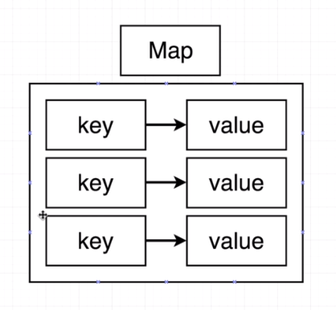
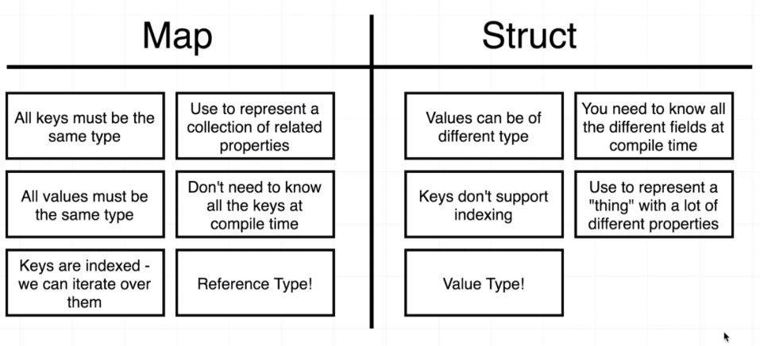

# Maps
Maps is collection of key/value pair, where keys have to be of the same type and values have to be of same type too.



## Initialization
A map can be initialized in 2 ways:
```
colors := map[string]string{
  "red":   "#FF0000",
  "green": "#00FF00",
  "blue":  "0000FF",
}
```
or 
```
colors1 := make(map[string]string)
colors1["white"] = "#FFFFFF"
```
Note that `var colors1 map[string]string` initializes a nil map and we can't add key/values to it.

## Remove a key/value

```
delete(colors1, "white")
```

## Iterating over a map

```
for key, value := range m {
  ...
}
```

## Maps vs Structs
