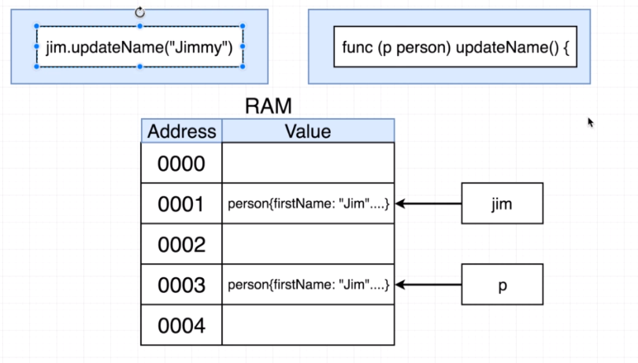
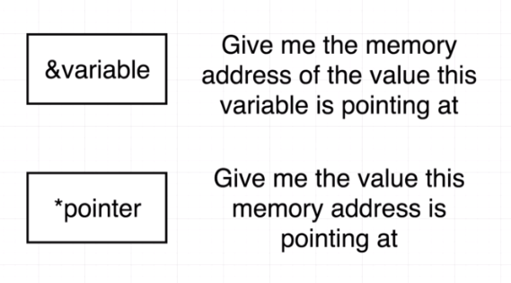
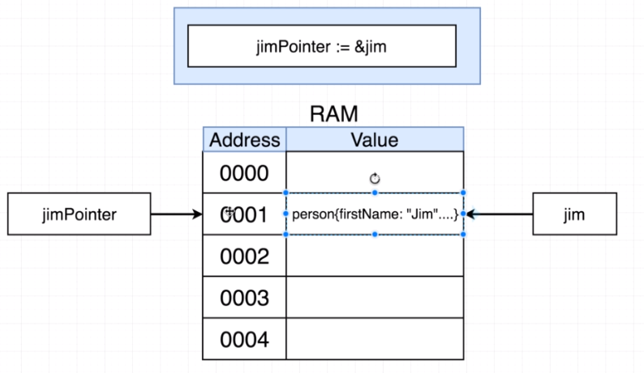
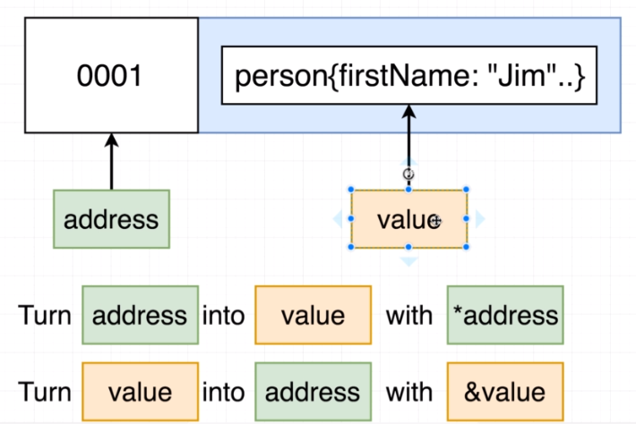
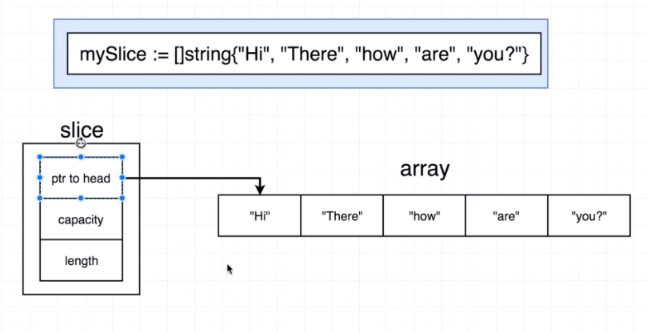
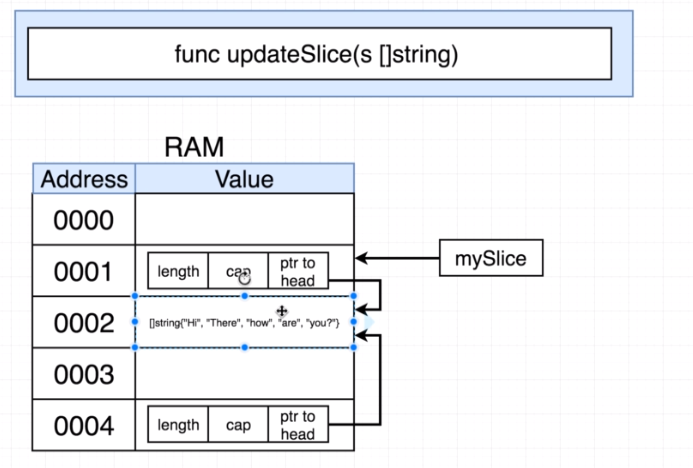
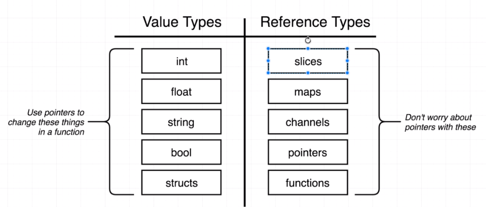

# Pointers
Go is a "pass by value" language, meaning that arguments or receivers passed to a function are actually a copy of the value:

It means that if we update values inside a function it won't get effect as it will be updating the "copy" received by the function.

We can use `&` to get the memory address of a variable and `*` to get the value of a memory address.

## References vs Value types
For slices it does not work as decribed before, because a slice is a struct that points to an array under the hoods.

The copy received by the function also has a struct that has a pointer to the same array.

In a nutshell, the Value Types need to take care about copies and pointer inside functions, while Reference Type doesn't.
